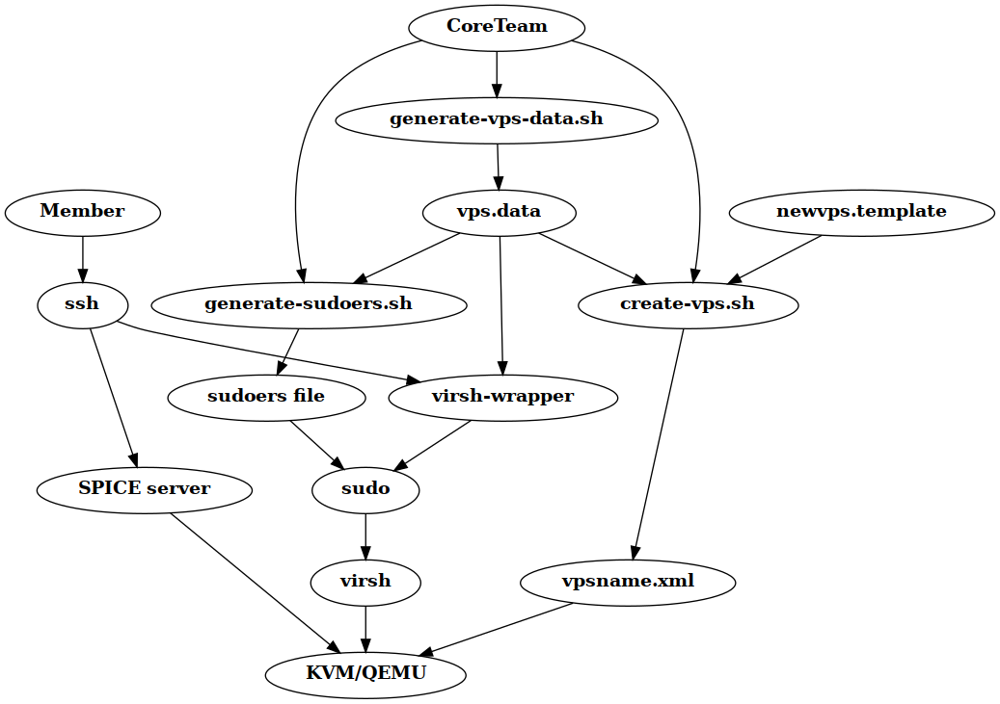

# Introduction
This repo contains an experiment in writing a multiuser wrapper around libvirt, which will allow our members to manage their own vps

# Big Picture


# Flow for creating a new vps
To deploy a new vps, the following steps need to be taken:
* Update vps data
* Update sudoers rules
* Create new VPS
* Installation of VPS

## Update vps data
These scripts work with input data, and this needs to be provided. For now, this is hardcoded, but in the future, 
someone from the CT will need to run the following script will pull data from LDAP and generate this file:
```
$ sudo generate-vps.data.sh
<fancy output to be added later>
```

## Update sudoers rules
Authorization of member commands is provided using generated sudo rules based on the vps data. In order to regenerate
these rules, the following command needs to be run:
```
$ sudo generate-sudoers.sh
```

## Create new VPS
Once the vps data is up to date, someone from the CT can run the `create-vps.sh` script. This script takes the vps
name and a full path to an iso file as parameters. It will run a bunch of checks, followed by the following steps:
* Create a logical volume
* Generate a unique mac address
* Define a new vps using the libvirt api
* Enable autostart for the new vps

A sample run of this command can be found below:
```buildoutcfg
[21:19:15] alita [soleus-virsh-wrapper] >> sudo ./create-vps.sh soleustest1 /var/lib/libvirt/images/CentOS-8.2.2004-x86_64-dvd1.iso
Domain soleustest1 defined from /tmp/tmp.iotgLdF9Ek
                                           
Domain soleustest1 marked as autostarted
                                           
VPS is defined. Installation is up to the user now.
```

## Installation of VPS
The member will need to login using ssh with a portforward for her/his SPICE portforward(s). Once this is configured,
the VPS of the member can be managed in two ways. The shell in which the user logs into is a custom shell which provides
a menu around wrapped virsh commands, which can be used to perform all major steps in managing a VPS. Some ASCII-shots
of this menu can be found below:

### Prompt after login
```
Libvirt multiuser shell v0.1

Your actions will apply to soleustest1

autostart   Toggle autostarting on boot of hypervisor
status      Show the status for your vps
start       Start your vps
shutdown    Shutdown your vps
reset       Reset your vps
reboot      Reboot your vps
attach_iso  Attach an iso to your vps
detach_iso  Eject an iso from your vps
help        Show this help
quit        Disconnect from this session
>>>       
```
### VPS status
```
>>> status
-----------------------------
 6    soleustest1   running
>>> 

```
### Starting the VPS
```
>>> start
Domain soleustest1 started

>>> 
```
### Toggling autostart for a VPS
```
>>> autostart
Domain soleustest1 unmarked as autostarted

>>> autostart
Domain soleustest1 marked as autostarted

>>> 
```
### ACPI shutdown of VPS
```
>>> shutdown
Domain soleustest1 is being shutdown

>>>
```
### ACPI reboot of VPS
```
>>> reboot
Domain soleustest1 is being rebooted

>>> 
```
### Hard reset of VPS
```
>>> reset
Domain soleustest1 was reset

>>> 
```
### Attaching an ISO to a VPS
```
>>> attach_iso
== The following iso images are available for installation:
debian-10.4.0-amd64-netinst.iso
CentOS-8.2.2004-x86_64-dvd1.iso

Your choice: CentOS-8.2.2004-x86_64-dvd1.iso
Successfully updated media.
>>>
```
### Detaching an ISO from a VPS
```
>>> detach_iso
Successfully ejected media.
>>> 
```
### Showing information for connecting to the console of a VPS
```
>>> console

You can connect to the console of your VPS by first setting up a ssh tunnel towards alita for your console
port, after which you can use your favourite SPICE client to connect to the console.

The following details are configured for soleustest1:

host:     127.0.0.1
port:     5733
password: testerdetest

>>> 
```